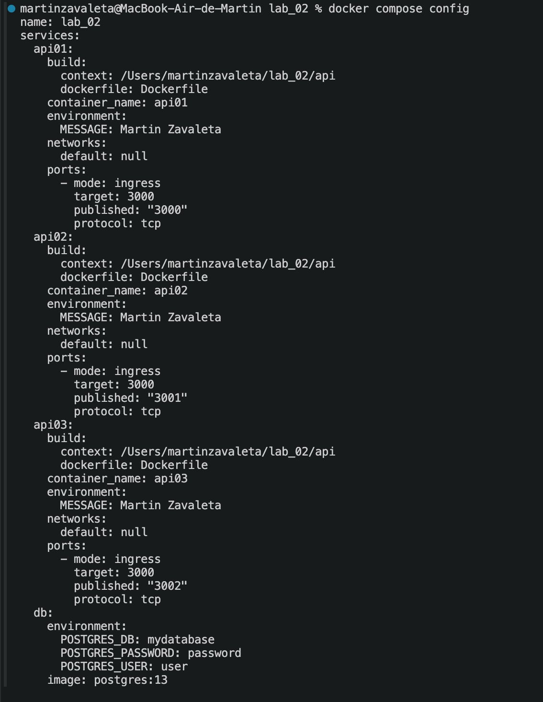
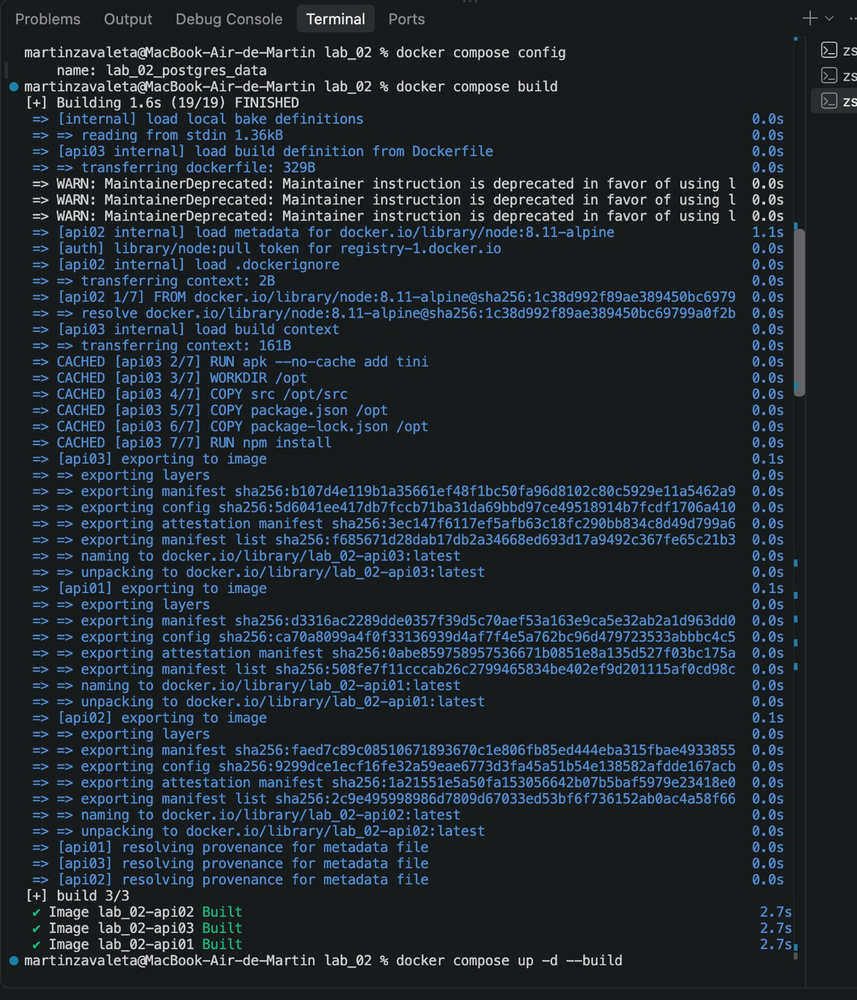
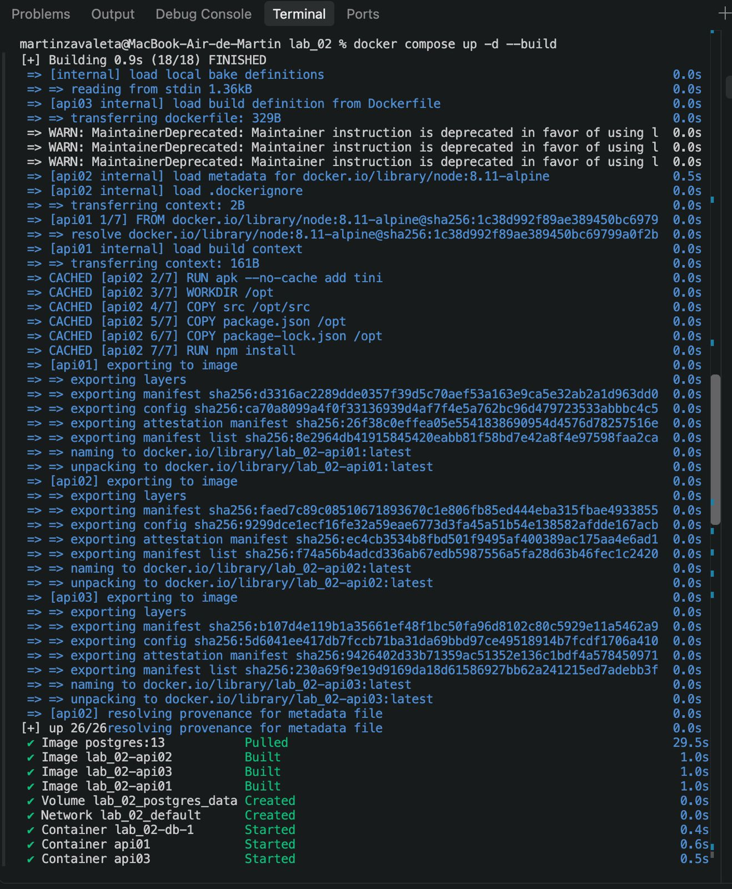
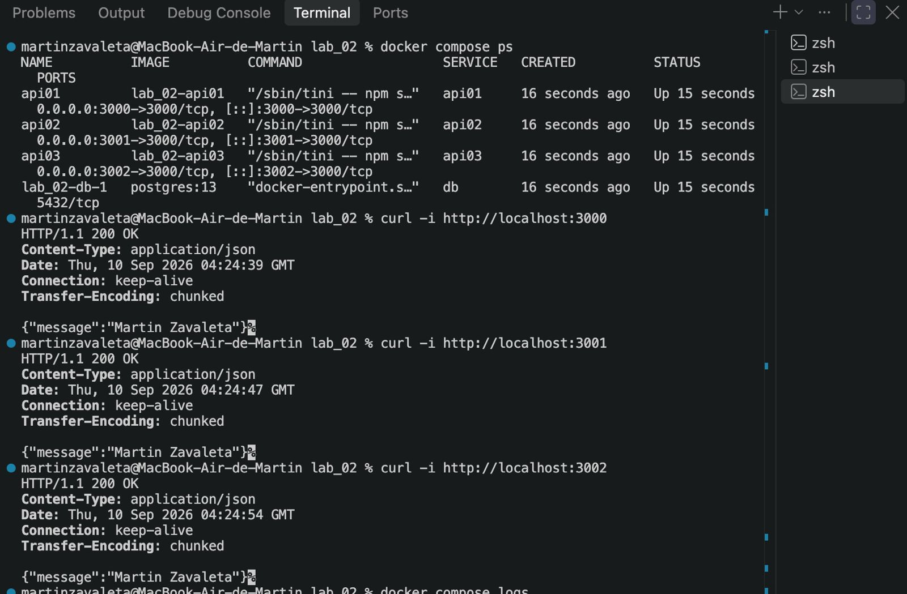

#Laboratorio 2 de Infraestructura

## Descripción

En este laboratorio se utiliza Docker Compose para desplegar un servicio web compuesto por tres instancias de una misma API y una base de datos PostgreSQL.

El proyecto también hace uso de variables de entorno y volúmenes.

## Stack técnico

- Docker
- Docker Compose
- API `hello-world-api`
- PostgreSQL 13
- Git
- GitHub

## Variables de entorno

El proyecto utiliza un archivo `.env` para almacenar el valor utilizado por la API.

Contenido:

```env
NOMBRE=Martin Zavaleta
```

# Comandos de despliegue

Todos los siguientes comandos deben ejecutarse desde la carpeta raíz `lab_02`.

## 1. Validar la configuración

```bash
docker compose config
```

Este comando permite comprobar que el archivo `docker-compose.yaml` tenga una configuración válida.

### Evidencia



---

## 2. Construir las imágenes

```bash
docker compose build
```

Este comando construye localmente la imagen utilizada por las tres instancias de la API.

### Evidencia



---

## 3. Desplegar los servicios


### Evidencia



---

## 4. Verificar los servicios

```bash
docker compose ps
```

Este comando permite verificar que las tres APIs y PostgreSQL estén ejecutándose correctamente.

Los servicios esperados son:

```text
api01
api02
api03
db
```

### Evidencia



---


# Red utilizada en el proyecto

## Red Bridge predeterminada de Docker Compose

En este proyecto no se configura una red dentro del archivo
`docker-compose.yaml`.

Sin embargo, al ejecutar Docker Compose, Docker crea automáticamente una
red predeterminada para los servicios definidos en el proyecto.

Esta red permite que los contenedores creados por Docker Compose puedan
comunicarse entre sí dentro del mismo host.

En este laboratorio, los servicios que forman parte de esta red son:

- `api01`
- `api02`
- `api03`
- `db`

La red se crea automáticamente al ejecutar:

```bash
docker compose up -d
```

# Volumen utilizado en el proyecto

## Named Volume para PostgreSQL

En este proyecto se utiliza un **volumen nombrado (Named Volume)** para
almacenar de manera persistente la información de PostgreSQL.

---
